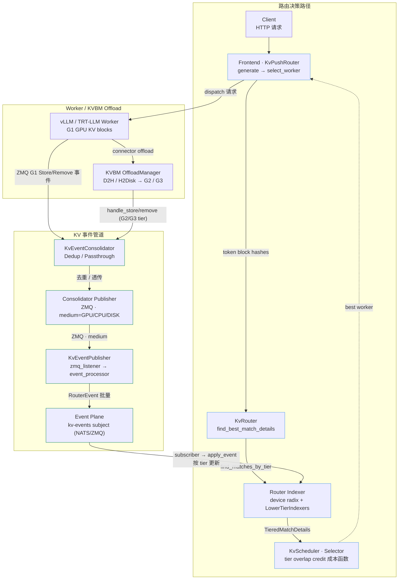
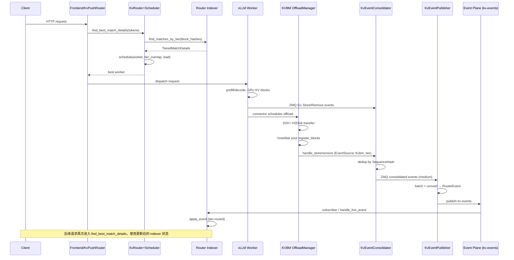
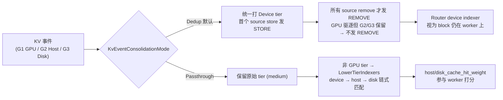

# Dynamo Router ↔ KVBM Offload 对接架构

> 基于 ai-dynamo/dynamo 代码库探索整理（`lib/kv-router`、`lib/llm/src/kv_router`、`lib/llm/src/block_manager`）。
> 整理日期：2026-06-12

## 总览

Router（KV-aware routing）与 Offload（KVBM 分层 KV cache）之间**没有直接函数调用**，而是通过 **KV cache 事件总线**异步耦合：Offload 状态变化以 Store/Remove 事件经 Consolidator 汇聚后发布到 event plane，Router indexer 订阅并按 storage tier 更新索引。

**关键结论：**

1. Offload 完成后**不会**直接回调 Router；Router 通过 **Store/Remove KV 事件**感知状态。
2. Router **能感知 storage tier**（`StorageTier`: Device / HostPinned / Disk / External），通过 `RouterEvent.storage_tier` 和 `medium` 字段路由到不同 indexer。
3. 默认 **Dedup** 模式下，Consolidator 把跨 G1/G2/G3 的 block 统一视为 **Device-tier 逻辑存在**，直到**所有 source 都 remove** 才向 Router 发 REMOVE；因此 GPU 驱逐但 G2/G3 仍保留时，Router 的 device indexer **继续认为 block 在该 worker 上**。
4. **Passthrough** 模式会保留 `tier`，lower-tier indexer 可单独记录 host/disk 命中，配合 `host_cache_hit_weight` / `disk_cache_hit_weight` 参与选 worker。

## 1. 整体架构（组件 + 数据流）



## 2. 完整时序图（请求 → Offload → Router 感知闭环）



### 分阶段说明

**A. 请求进入 → Router 决策**

1. `KvPushRouter::generate` → `select_worker`
2. `KvRouter::find_best_match_details`：算 token block hashes → `Indexer::find_matches_by_tier` → 加权 cache hit → `KvScheduler::schedule` → `DefaultWorkerSelector::select_worker`
3. 非 query-only 时更新 active sequences（prefill/decode load tracking）

**B. Worker 执行 → Offload 触发**

1. vLLM 在 GPU 上产生 KV blocks，通过 engine ZMQ 发 G1 事件
2. `ManagedBlockPool::register_blocks` 注册 immutable block
3. 若 `offload_priority` 存在 → `enqueue_offload` → `OffloadManager` worker 线程执行 D2H/H2Disk
4. Host/Disk pool 再次 `register_blocks`

**C. 状态更新 → Router 感知**

1. `DynamoEventManager` → `KvEventConsolidatorHandle::handle_store/remove`
2. `DedupCacheStatusTracker`：首 store 发 STORE；末 source remove 发 REMOVE
3. `KvEventConsolidatorPublisher` → ZMQ（`medium` 字段）
4. Worker `KvEventPublisher` 的 `zmq_listener` 收 batch → `event_processor` 批处理
5. `sinks::emit` 发布 `RouterEvent` 到 `kv-events` subject
6. Router `start_subscriber` 收事件 → `handle_live_event` → `Indexer::apply_event`

**D. Router 后续决策**

- 下一次请求的 `find_matches_by_tier` 使用更新后的 radix tree / lower-tier continuation
- GPU 仍可见（Dedup）或 host/disk tier 单独计分（Passthrough/tier-tagged events）
- Scheduler 的 decode/prefill load 由 active sequence 事件独立维护，与 offload 并行

## 3. Consolidation 模式对 Router 的影响



## 4. Selector 成本函数（含 tier credit）

```text
overlap_credit = overlap_score_credit × device
              + host_cache_hit_weight × host_pinned
              + disk_cache_hit_weight × disk
              + shared
prefill_blocks = max(raw_prefill − overlap_credit, 0)
logit          = prefill_cost + decode_cost        // 越小越优
```

见 `lib/kv-router/src/scheduling/selector.rs` 的 `DefaultWorkerSelector::worker_logit`。

## 5. 交互数据结构

| 结构 | 定义位置 | 方向 | 含义 |
|------|---------|------|------|
| `StoreEventInput` / `RemoveEventInput` | `kv_consolidator/tracker.rs` | KVBM → Consolidator | block_hash + source=Kvbm + tier |
| `ConsolidatedEvent::{Store,Remove,ClearAll}` | `kv_consolidator/tracker.rs` | Consolidator 内部队列 | 去重后的对外事件 |
| `Event::BlockStored { medium }` | `kv_consolidator/publisher.rs` | Consolidator → ZMQ | medium = GPU / CPU_TIER1 / CPU_TIER2 |
| `PlacementEvent` | `kv-router/src/protocols.rs` | Worker publisher 内部 | placement.tier + KvCacheEvent |
| `RouterEvent` | `kv-router/src/protocols.rs` | Worker → Event plane → Router | worker_id + storage_tier + event |
| `TierOverlapBlocks` | `kv-router/src/scheduling/types.rs` | Indexer → Scheduler | device / host_pinned / disk 每 worker 命中数 |
| `SchedulingRequest` | `kv-router/src/scheduling/types.rs` | Router → Selector | tier_overlap + effective_overlap |

## 6. 关键配置

| 配置 | 位置 | 作用 |
|------|------|------|
| `--router-mode kv` | frontend | 启用 KV-aware routing |
| `--router-kv-events` / `use_kv_events` | `KvRouterConfig` | 是否消费 worker KV 事件 |
| `--router-kv-overlap-score-credit` | `KvRouterConfig` | GPU prefix overlap 权重 |
| `host_cache_hit_weight` / `disk_cache_hit_weight` | `kv-router/src/scheduling/config.rs` | CPU / disk tier 命中权重 |
| `DYN_KVBM_KV_EVENTS_ENABLE_CONSOLIDATOR` | `consolidator_config.py` | 是否启用 Consolidator |
| `DYN_KVBM_CPU_CACHE_GB` / `DYN_KVBM_DISK_CACHE_GB` | `block_manager/config.rs` | G2 / G3 容量，影响 bypass CPU |
| `DYN_KVBM_LEADER_ZMQ_PUB_PORT` | consolidator endpoints | Consolidator 输出 ZMQ 端口 |

## 7. 代码地图

### Router 侧

| 文件 / 模块 | 关键内容 |
|------------|---------|
| `lib/kv-router/src/protocols.rs` | `StorageTier`, `KvCacheEvent`, `RouterEvent`, `KV_EVENT_SUBJECT` |
| `lib/kv-router/src/indexer/` | `KvIndexer`, `LowerTierIndexers`, `TieredMatchDetails` |
| `lib/kv-router/src/scheduling/` | `LocalScheduler`, `DefaultWorkerSelector`, `TierOverlapBlocks`, `KvRouterConfig` |
| `lib/kv-router/src/zmq_wire/convert.rs` | `convert_event`：medium → StorageTier → PlacementEvent |
| `lib/llm/src/kv_router.rs` | `KvRouter`, `find_best_match_details`, `cache_hit_weight_for_tier` |
| `lib/llm/src/kv_router/push_router.rs` | `KvPushRouter`, `select_worker`, `AsyncEngine::generate` |
| `lib/llm/src/kv_router/indexer/` | `find_matches_by_tier`, `apply_event`, `start_subscriber`, `handle_live_event` |
| `lib/llm/src/kv_router/publisher/` | `KvEventPublisher`：zmq_listener → event_processor → sinks::emit |
| `lib/bindings/python/rust/llm/kv.rs` | `KvRouter` / `KvPushRouter` / `KvEventPublisher` PyO3 绑定 |

### Offload 侧（KVBM）

| 文件 / 模块 | 关键内容 |
|------------|---------|
| `lib/llm/src/block_manager/offload.rs` | `OffloadManager`：D2H / H2D / H2Disk / D2D workers |
| `lib/llm/src/block_manager/pool/managed/state.rs` | `register_blocks` → `enqueue_offload`（offload 触发点） |
| `lib/llm/src/block_manager/events.rs` | `DynamoEventManager::publish_store_events` → `handle_store` |
| `lib/llm/src/block_manager/kv_consolidator/` | `KvEventConsolidator`：tracker（Dedup/Passthrough）+ ZMQ publisher |
| `lib/llm/src/block_manager/config.rs` | `should_bypass_cpu_cache()`：G1 → G3 直传 |
| `lib/bindings/kvbm/.../connector/leader/slot.rs` | `process_offload_request`（G1→G2 或 G1→G3） |
| `lib/bindings/kvbm/python/kvbm/vllm_integration/consolidator_config.py` | `should_enable_consolidator`, `get_consolidator_endpoints` |

## 8. 测试与文档参考

| 路径 | 用途 |
|------|------|
| `tests/kvbm_integration/test_consolidator_router_e2e.py` | Consolidator + Router E2E；STORE/REMOVE dedup 跨 G1/G2/G3 |
| `tests/router/test_router_e2e_with_vllm.py` | Router E2E |
| `examples/backends/vllm/launch/agg_kvbm_router.sh` | Aggregated + KV routing + KVBM |
| `docs/design-docs/router-design.md` | Router 设计 |
| `docs/design-docs/kvbm-design.md` | KVBM 分层与数据流 |
